# SmartIK

### In this project, advance, permission and expense tracking processes are carried out for human resources.
### In this project, it was carried out with task management and daily scrums in the form of sprints in a Scrum team of four people over Azure DevOps.
### The technologies I used in the project are as follows.
#### - HTML – CSS – JS – Jquery
#### - .Net Core MVC
#### - Maintenance in UI/UX
#### - Developing with Scrum Team from Azure DevOps.

#### Login Panel
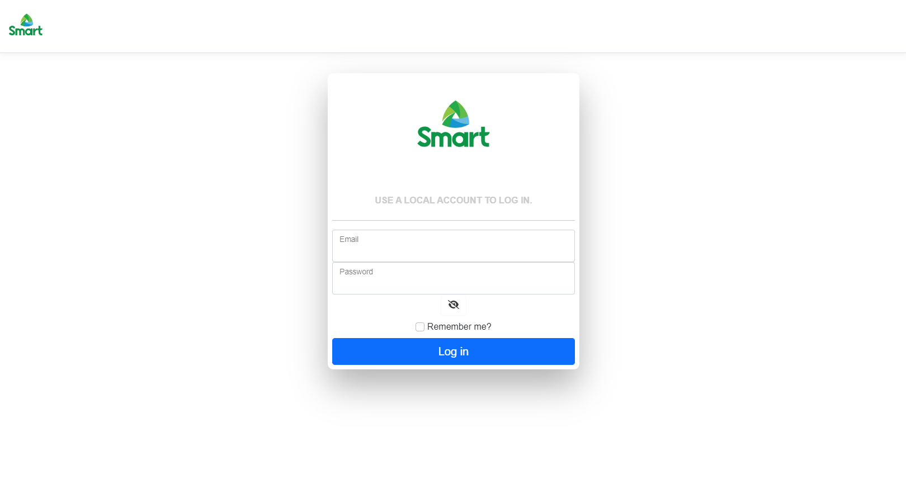
#### Admin Layout
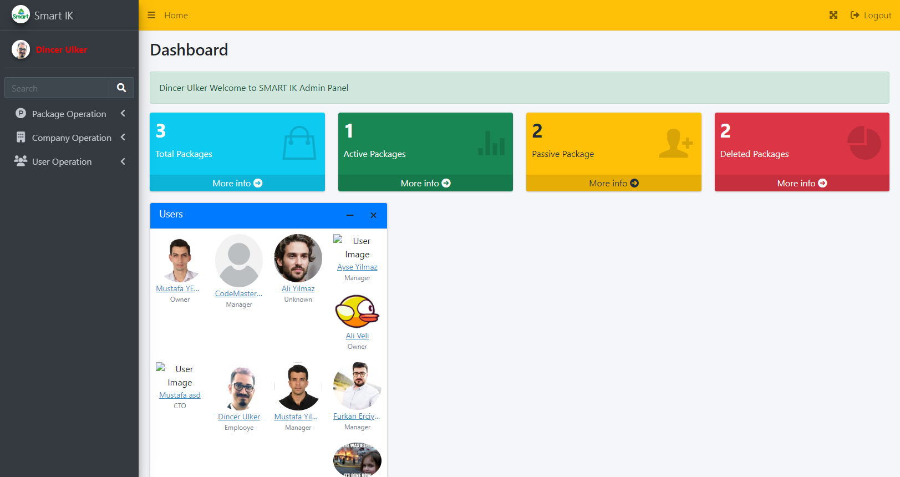
#### User Layout
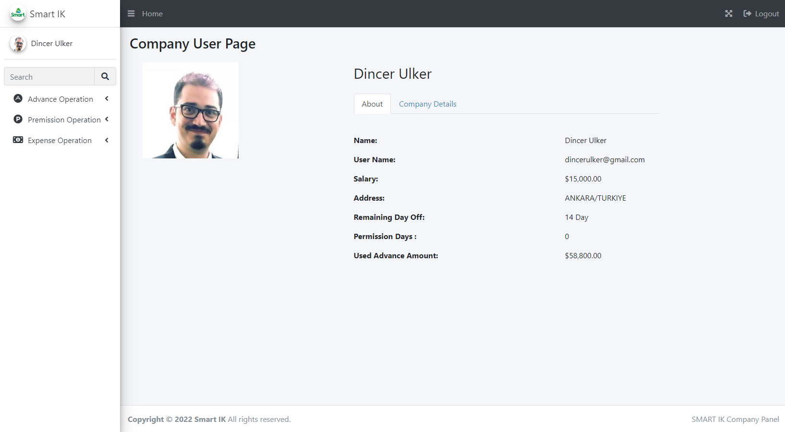
#### Users
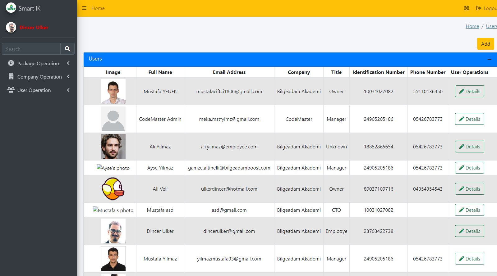
#### Packages
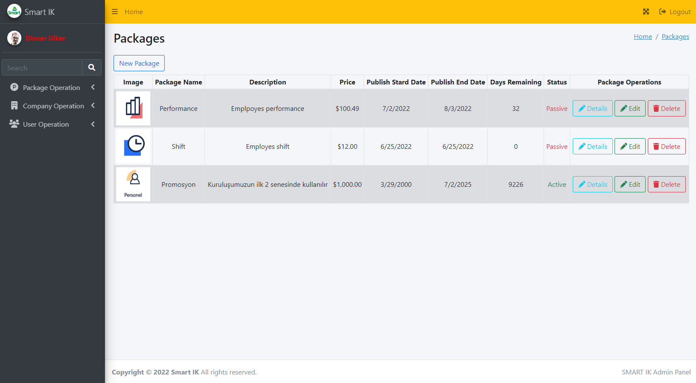
#### Companies
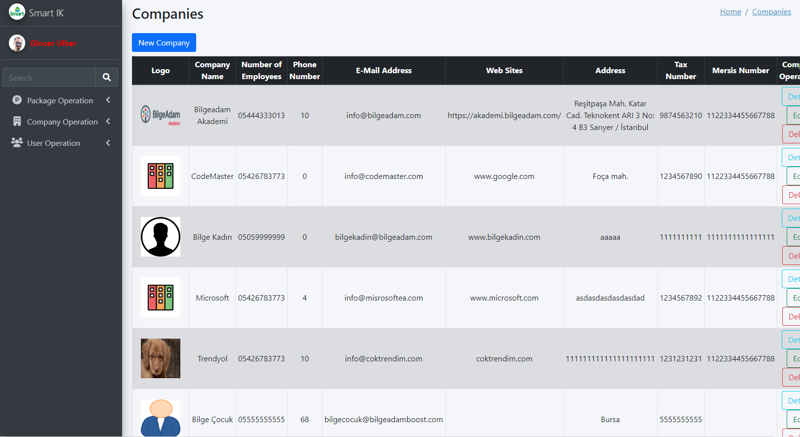
#### Create Company
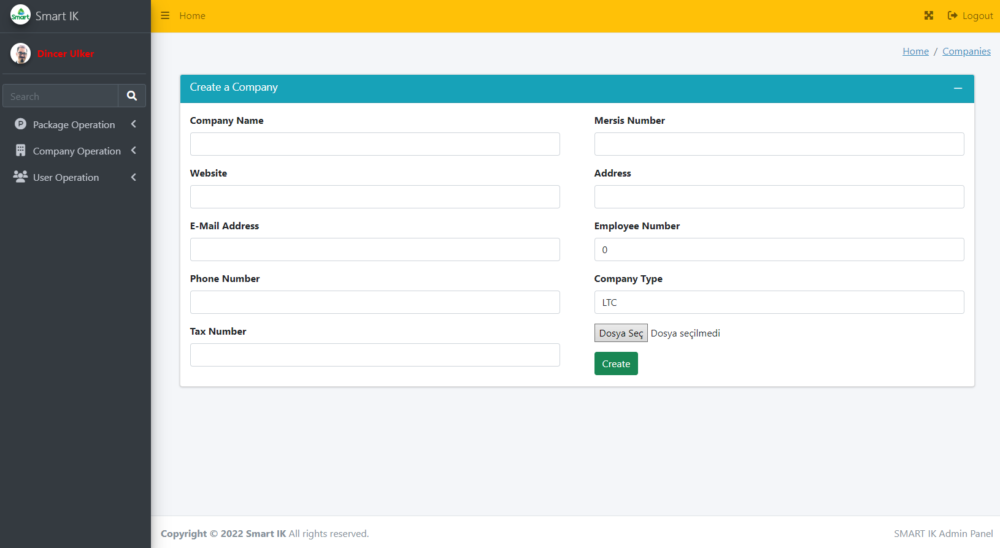
#### Create Company Manager
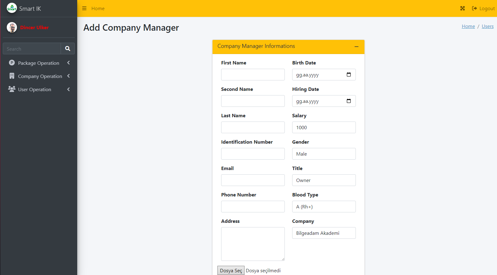
#### Create Package
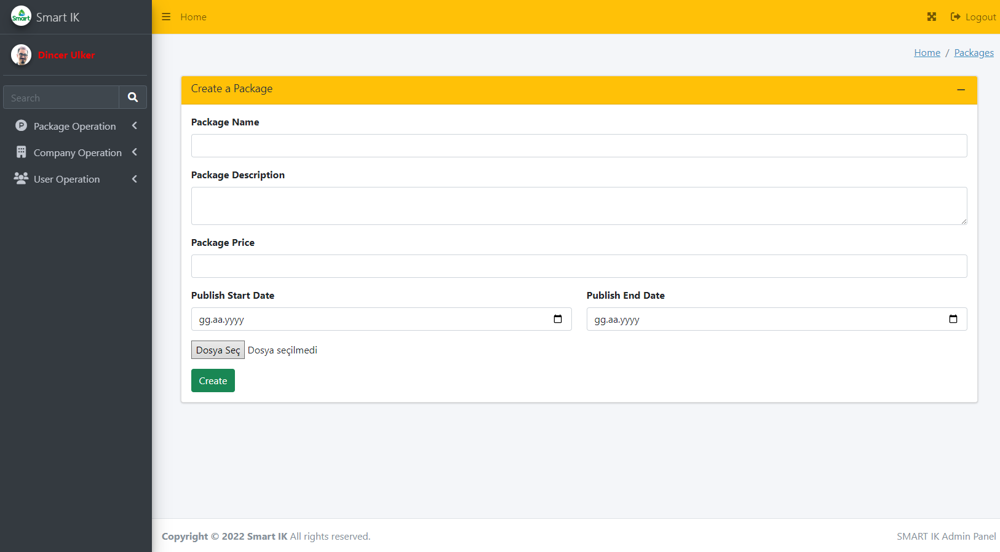
#### Expense View
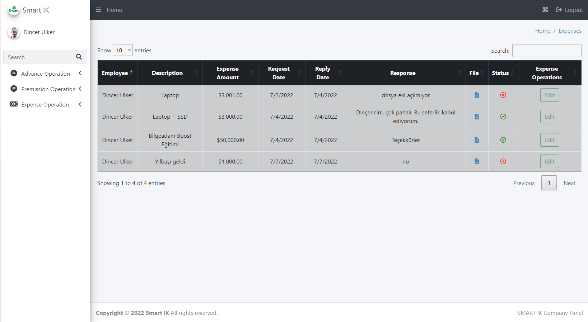
#### Expense Create
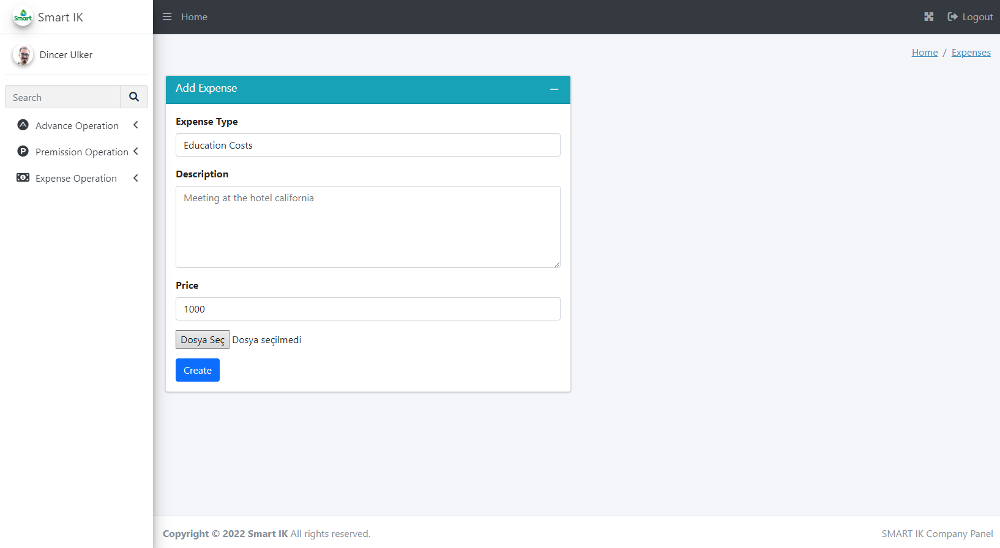
#### Advance View
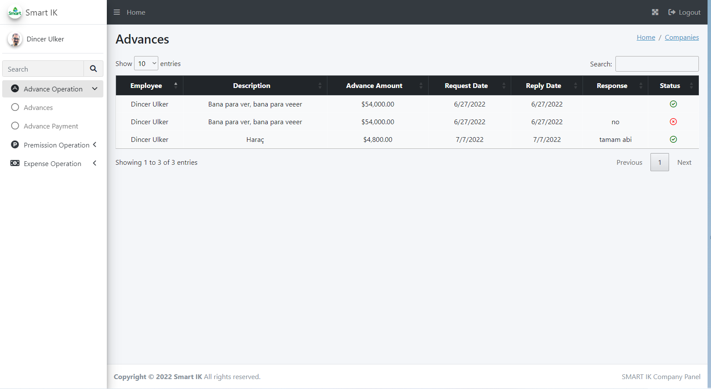
#### Advance Create
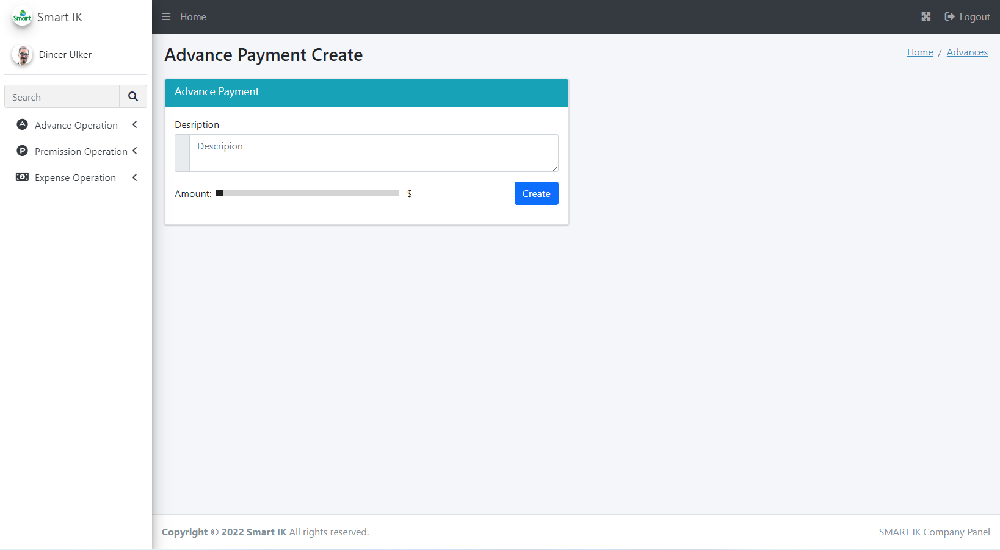
#### Permission View
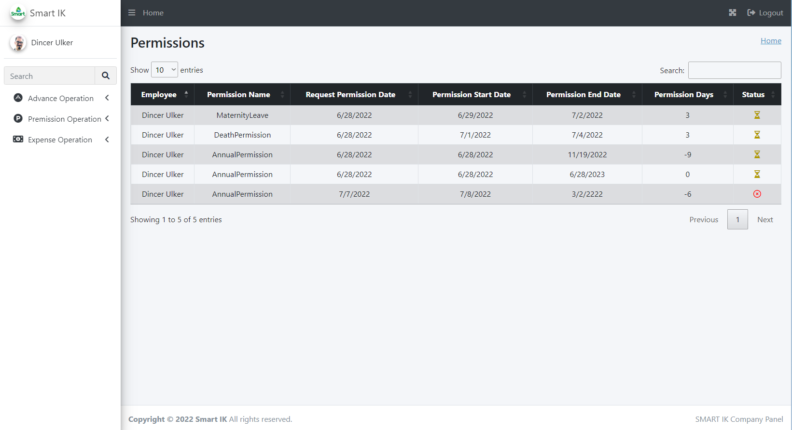
#### Permission Create
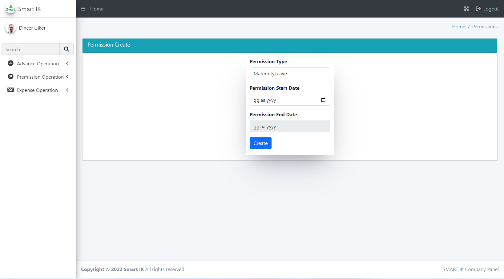
#### Logout
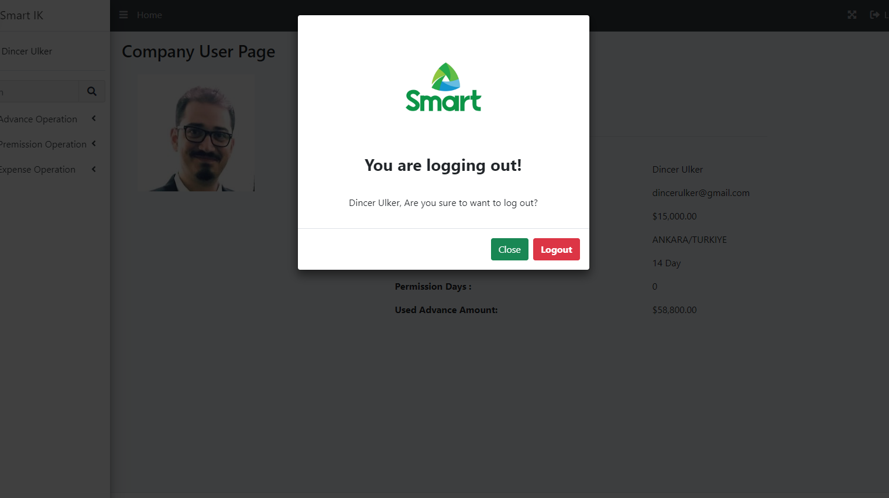
